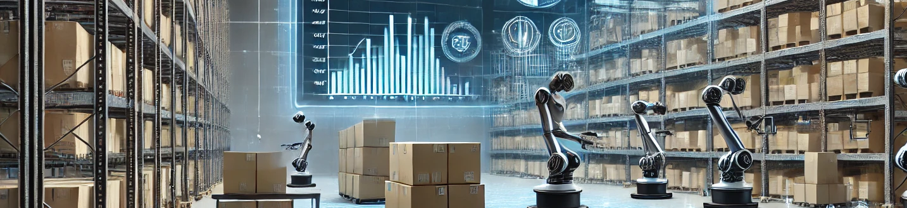

<h2 align="center">  
  Sistema de Automação para Verificação de Estoque com Notificações em Tempo Real (v1.0)  
     
  <a href="https://github.com/lesistemas/Portfolio.git" target="_blank">GitHub Repository</a>  
</h2>  

  

   

    
    
    
    

  

<h3 align="center">  
    🔹  
    <a href="https://github.com/lesistemas/Portfolio/issues">Reportar Bug</a> &nbsp; &nbsp;  
    🔹  
    <a href="https://github.com/lesistemas/Portfolio/issues">Solicitar Funcionalidade</a>  
</h3>  

<h2>Resumo</h2>  

  
O <strong>Sistema de Automação para Verificação de Estoque</strong> é uma ferramenta desenvolvida para verificar estoques de produtos em um site de e-commerce, automatizar comparações com arquivos CSV, e emitir notificações em tempo real sempre que há mudanças significativas. Além disso, o sistema gera automaticamente relatórios sobre produtos vendidos e suas respectivas horas de venda.  

<h2>Tecnologias Utilizadas</h2>  

<ul>  
  <li><strong>C#</strong></li>  
  <li><strong>Selenium WebDriver</strong></li>  
  <li><strong>Entity Framework Core</strong></li>  
  <li><strong>CSVHelper</strong></li>  
  <li><strong>SQL Server</strong></li>  
  <li><strong>Kafka (para mensageria e notificações)</strong></li>  
  <li><strong>Timer</strong> (para verificações automáticas recorrentes)</li>  
</ul>  

<h2>Arquitetura (DDD)</h2>  

  
O projeto utiliza a arquitetura <strong>Domain-Driven Design (DDD)</strong> para separar responsabilidades, garantindo um código modular e de fácil manutenção.  

<ul>  
  <li><strong>Domínio</strong>: Contém as regras de negócios e entidades principais, como produtos e vendas.</li>  
  <li><strong>Aplicação</strong>: Responsável por coordenar as operações, como enviar notificações e comparar listas de produtos.</li>  
  <li><strong>Infraestrutura</strong>: Persistência de dados via Entity Framework e comunicação com serviços externos, como Kafka e Selenium.</li>  
  <li><strong>Apresentação</strong>: Interface de entrada, onde o sistema interage com o usuário ou com outros serviços via Timer.</li>  
</ul>  

<h2>Funcionalidades</h2>  

<ul>  
  <li>📊 <strong>Verificação de Estoque em Tempo Real</strong>: O sistema verifica automaticamente o estoque dos produtos em intervalos regulares.</li>  
  <li>🔄 <strong>Atualização Automática de Produtos no CSV</strong>: Compara os dados do estoque com um arquivo CSV local e atualiza automaticamente as informações.</li>  
  <li>🗂 <strong>Geração de CSV para Itens Vendidos</strong>: Gera um arquivo CSV com detalhes de vendas, incluindo o horário de transações e a quantidade de itens vendidos.</li>  
  <li>⏲ <strong>Execução Automática via Timer</strong>: Substitui a necessidade de rodar como um serviço do Windows, utilizando um timer para realizar verificações periódicas de estoque.</li>  
</ul>  

<h2>Integração com Kafka</h2>  

  
O sistema inclui um módulo separado para <strong>mensageria via Kafka</strong>, que opera independentemente e está sempre pronto para processar as mensagens enviadas pelo sistema principal.  

  
Sempre que ocorre uma mudança importante no estoque (como a chegada de novos produtos ou esgotamento), notificações são enviadas via Kafka para um sistema secundário, o <strong>KafkaConsumerWithMailNotifier</strong>, que então processa essas mensagens e envia alertas para os usuários em tempo real.  

<h2>Integração com RPA</h2>  

  
A automação é feita com <strong>RPA (Automação Robótica de Processos)</strong> usando o <strong>Selenium WebDriver</strong> para simular a navegação de um usuário no site e capturar dados de estoque e preços.  

  
Todo o processo de coleta e atualização é automatizado, garantindo uma verificação eficiente e sem intervenção humana.  

<h2>Estrutura de Pastas</h2>

A seguir está a estrutura do projeto para facilitar a navegação:

<pre>
ProjectRoot/
├── Domain/
│   ├── Entities/
│   ├── Services/
├── Application/
│   ├── Notifications/
│   ├── ProductComparison/
├── Infrastructure/
│   ├── Data/
│   ├── Kafka/
├── Presentation/
│   ├── ProductAvailabilityAutomation/
│   ├── KafkaConsumerWithMailNotifier/
</pre>

<h2>Instruções de Instalação</h2>  

Siga os passos abaixo para clonar e executar o projeto.

<h3>🛠 Instalação</h3>  

<ol>  
  <li>Clone o repositório:  
   <code>git clone https://github.com/lesistemas/Portfolio.git</code>  
  </li>  
  <li>Instale as dependências necessárias, incluindo:  
    <ul>  
      <li>Selenium WebDriver</li>  
      <li>Entity Framework Core</li>  
      <li>Kafka</li>  
      <li>CSVHelper</li>  
    </ul>  
  </li>  
  <li>Configure sua string de conexão no arquivo <code>ProductDbContext.cs</code>.</li>  
  <li>Certifique-se de que o serviço Kafka esteja rodando localmente.</li>
</ol>  

<h3>Execução</h3>  

<ol>  
  <li>Inicie o serviço no Visual Studio ou configure o Timer para execução automática.</li>  
  <li>O sistema verificará o estoque periodicamente e atualizará o CSV com base nas mudanças detectadas.</li>  
  <li>O <strong>KafkaConsumerWithMailNotifier</strong> deve estar em execução para processar mensagens de notificação.</li>  
</ol>  

<h2>Como Funciona</h2>  

<ul>  
  <li>O sistema utiliza <strong>Selenium WebDriver</strong> para acessar um site e capturar dados dos produtos.</li>  
  <li>Um arquivo CSV local é comparado com os dados capturados, e qualquer mudança é automaticamente registrada.</li>  
  <li>O sistema gera um segundo CSV com os detalhes dos itens vendidos e suas respectivas quantidades.</li>  
  <li>As notificações são geradas e enviadas pelo <strong>Kafka</strong> em caso de mudanças críticas no estoque.</li>  
</ul>  

<h2>Exemplo de Uso</h2>  

  
O serviço roda em segundo plano, verificando e atualizando o arquivo CSV com informações sobre o estoque em tempo real. As notificações são enviadas assim que eventos relevantes são detectados.  

<h2>Suporte</h2>  

Dê uma ⭐ no repositório se gostou do projeto!

